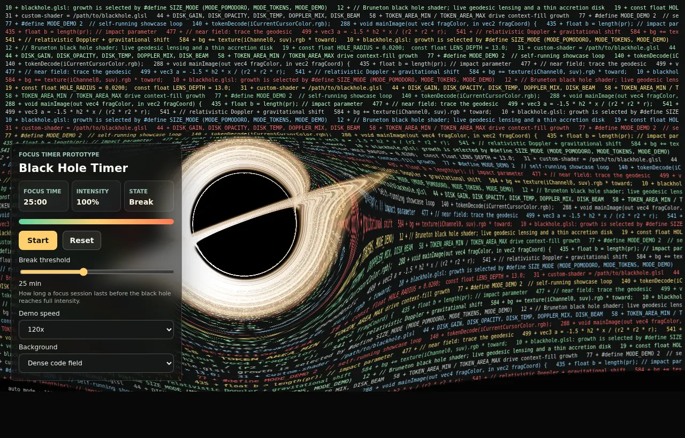

# Black Hole Timer <sub><sup>[EN](./README.md) | ZH</sup></sub>

Black Hole Timer 把一个真实感的 ray-traced 黑洞放进浏览器。专注时间越接近上限，黑洞和吸积盘越明显，背后的页面越像被引力扭曲，用比普通计时器更强烈的方式提醒用户该休息了。



在线 Demo：<https://blackhole-timer.vercel.app/>

## 为什么做这个

原项目 [Ghostty Blackhole](https://github.com/s0xDk/ghostty-blackhole)
把 ray-traced 黑洞效果做进了 Ghostty 终端里。我很喜欢这个效果，但我没有安装这个终端，
也更想在自己更常用的场景里使用它：浏览器页面和电脑桌面。所以我 fork 了原项目继续做二次开发，
保留 shader 来源，并尝试把黑洞变成一种屏幕使用时长和休息提醒。

## 适用场景

- 专注工作计时：工作时间越长，黑洞越大。
- 久坐或长时间看屏幕提醒：到达阈值后提示休息。
- 网页停留时长实验：后续可以扩展成浏览器插件。
- 会议、演讲、学习、截止时间倒计时：用更有压迫感的视觉效果表达时间消耗。

## 快速运行

浏览器 demo 不需要构建步骤。

```sh
git clone https://github.com/cabbagehao/blackhole-timer.git
cd blackhole-timer
python3 -m http.server 4173
```

打开：

```text
http://127.0.0.1:4173/
```

Windows 上如果没有 `python3` 命令，可以用：

```powershell
py -m http.server 4173
```

## 浏览器 Demo

页面会先把工作场景绘制到离屏 canvas，再作为 `iChannel0` 传给 WebGL2 黑洞 shader。计时进度会驱动原 demo 的时间线，所以黑洞会随着进度增大并变化形态。

常用 URL 参数：

```text
http://127.0.0.1:4173/?preview=0.85
http://127.0.0.1:4173/?scene=work&preview=0.85
http://127.0.0.1:4173/?autoplay=0
```

- `preview` 设置初始进度，范围是 `0` 到 `1`。
- `scene=work` 从密集代码背景切换到工作台 mockup。
- `autoplay=0` 关闭默认自动播放。

## 控制项

- Start/Pause：开始或暂停模拟专注时段。
- Reset：重置黑洞大小。
- Break threshold：专注时段长度，单位分钟；到达阈值后黑洞达到 100% 强度，状态变为 `Break`。
- Demo speed：加速预览，支持 1x、3x、5x、10x、30x、120x、600x。
- Background：切换密集代码参考背景或工作台 mockup。

## 浏览器插件原型

`extension/` 目录里有一个 Chrome/Edge Manifest V3 插件原型。它测试的是本地透镜方案：定时捕获当前标签页，把截图作为 shader 纹理，只在黑洞透镜区域覆盖一个柔边 canvas，其余网页仍保持真实 DOM。

可以在 `edge://extensions/` 或 `chrome://extensions/` 中开启开发者模式，然后选择 `extension/` 目录加载。

## Windows 桌面原型

Windows 相关对比版本见 [WINDOWS_DESKTOP.md](./WINDOWS_DESKTOP.md)，包括 Electron、WebView2 和原生 D3D 的桌面覆盖层实验。

## 实现说明

- 浏览器 demo 不需要构建步骤，也不依赖第三方包。
- `src/blackhole-port.frag` 派生自 Ghostty 黑洞项目，保留了原 geodesic-tracing shader 主体；修改主要是 WebGL2 兼容和浏览器 uniform 接入。
- 浏览器 JavaScript 提供 Ghostty/Shadertoy 风格的 uniform：`iResolution`、`iTime`、`iDate`、`iChannel0`，以及原 token 模式使用的 cursor-color token 通道。
- shader 运行在 `MODE_DEMO`，JavaScript 将计时进度映射到 shader demo 时间线，因此吸积盘形态会随进度变化。

## 致谢

黑洞 shader 派生自 [s0xDk/ghostty-blackhole](https://github.com/s0xDk/ghostty-blackhole)，原项目使用 MIT License。

原 shader 也致谢 Eric Bruneton 的 [Black Hole Shader](https://ebruneton.github.io/black_hole_shader/)。

## License

MIT。详见 [LICENSE](./LICENSE)。
